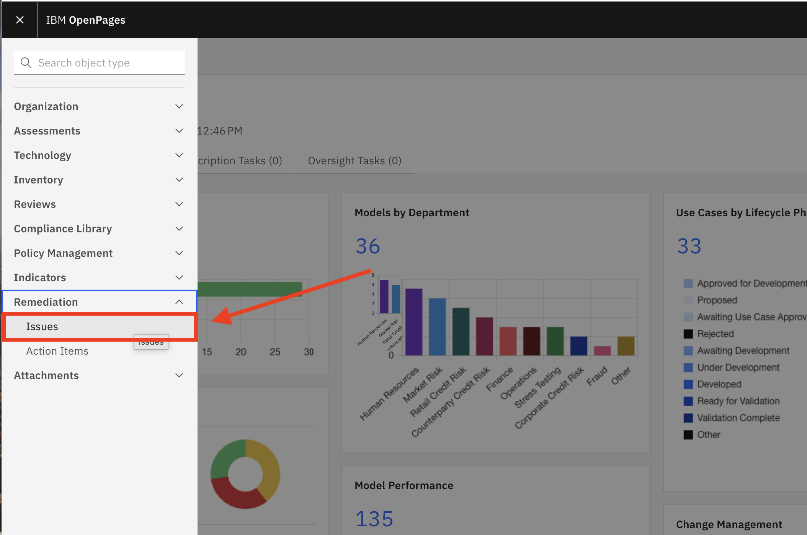
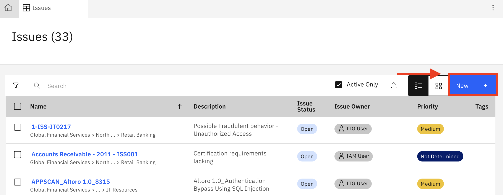
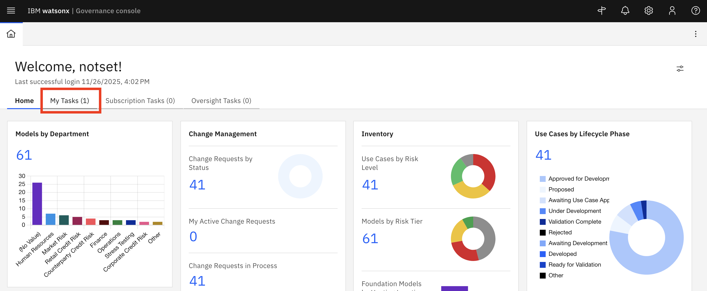
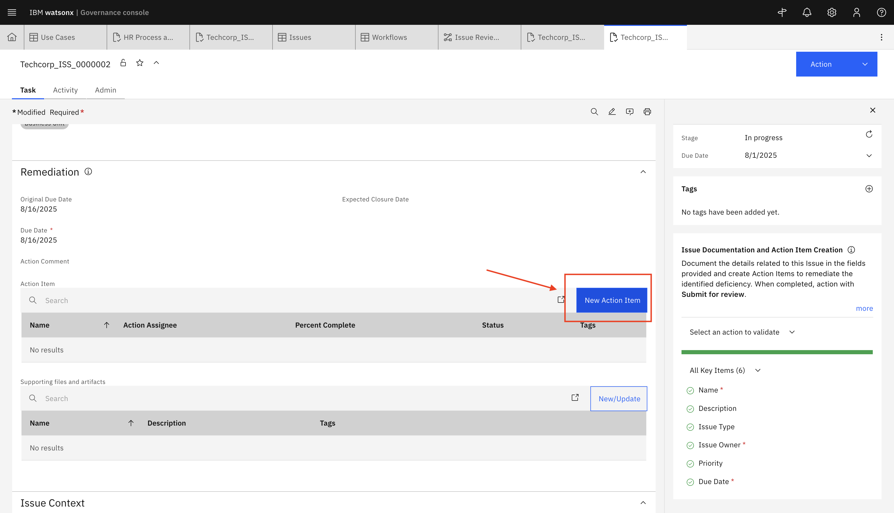
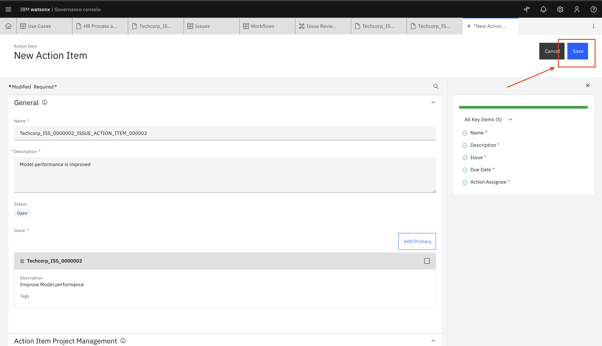
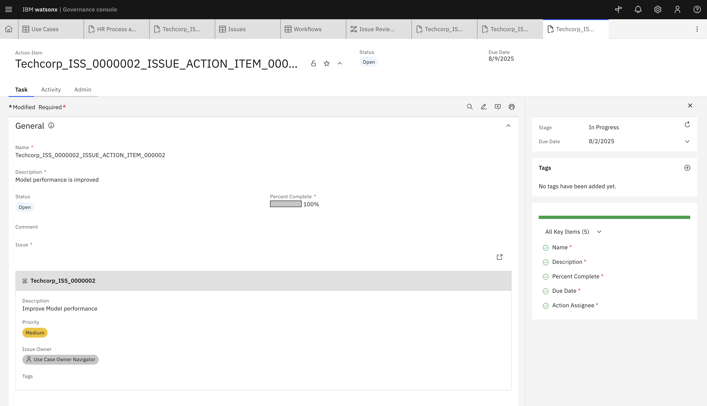
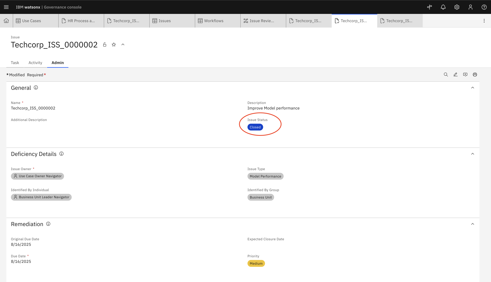

# Step 3 — Incident Management

> [!NOTE]
> **Beyond today's session — see what you can do next.**
> Incident Management closes the loop on the AI governance lifecycle: investigating and
> resolving a live production issue. It goes beyond what we have time for today, but
> everything below is self-contained if you'd like to work through it on your own afterwards.

---

> **Login Note:** Before starting, ensure you are logged into IBM OpenPages with the
> **watsonx-governance MRG Master** profile.

---

> [!NOTE]
> **Instructor Setup — completed before this lab session**
>
> The following was prepared during the prep week so you can start immediately:
> 1. Your assigned Use Case was advanced through the full AI lifecycle to **"In Operation"** status
> 2. A failing **Answer Relevance** metric value was injected on your Use Case
> 3. An **Issue** was automatically created and assigned to your user account
>
> Your Issue is waiting in your **My Tasks** inbox right now.

---

## Your Assignment

> **Your assigned Use Case:** ___________________________________________
>
> *(Your Use Case name was shared with you before the session started)*

Your Issue has been pre-created on this Use Case and is waiting in your **My Tasks** inbox.
**Go straight to Step 1 below to begin.**

---

> **Issue not in your inbox?**
>
> If you do not see an Issue in My Tasks, create one manually:
> 1. Click the **Hamburger Menu → Remediation → Issues**
>
> 
>
> 2. Click **New +**
>
> 
>
> 3. Fill in:
>    - **Issue Name:** `Answer Relevance Breach — [your Use Case name]`
>    - **Issue Owner:** yourself (your login account)
>    - **Parent Entity:** your assigned Use Case
> 4. Click **Save** — then continue to Step 1 below

---

## What is Incident Management?

Incident Management in IBM OpenPages allows **Risk & Compliance Officers** to track, assess,
mitigate, and communicate risks when something goes wrong with a live AI system. It provides
a structured workflow for logging issues, assigning responsibilities, and ensuring timely
resolution — creating a full audit trail at every step.

### Your scenario

Your AskHR AI system is live and being used by real employees to answer HR policy questions.
The **Answer Relevance** metric has dropped below its configured threshold.

> **What is Answer Relevance?** Answer Relevance measures whether the AI's response actually
> addresses what the user asked. A score below the threshold means employees are receiving
> answers that are off-topic or unhelpful — for example, asking about parental leave policy
> and getting a response about a different policy entirely. This is exactly the kind of
> quality failure that governance frameworks like the EU AI Act require organisations to
> detect, log, and remediate with a documented audit trail.

Your job is to investigate, document a remediation plan, get it approved, and close the
incident — leaving a complete record of what happened and what was done about it.

---

## Step 1 — Navigate to Your Assigned Issue

- Click on the **My Tasks** tab in IBM OpenPages.

- Locate and select the Issue assigned to your Use Case.

---

## Step 2 — Assess Risk and Add Mitigation Actions

- Review the Issue details — determine the **Issue Type**, **Issue Status**,
  **Who Identified the Issue**, and **Priority**

> You can view the related metric in the **Issue Context** section at the bottom of the
> Issue card — this shows the Answer Relevance breach that triggered the incident.

- Create an Action Item to remediate the identified deficiency — click **New Action Item**

> **Why create an Action Item?** Closing an issue directly would leave no documented record of what was actually done to fix it. An Action Item is the formal remediation record — it captures who did what and when, and creates the audit trail that regulators require. Without it, you cannot prove the issue was properly addressed.

- Fill out all key details and click **Save**

- The Action Item has been created.

- Document the remediation steps you plan to take, then click **Actions → Submit for Approval**

 Submit for approval" src="./assets/Issue5.png">

- Click **Actions → Approve** to approve the action item.

 Approve to approve the action item." src="./assets/Issue7.png">

---

## Step 3 — Submit for Review

> **Why submit for review before closing?** This gate enforces segregation of duties — the same person who documented the remediation should not be the one who signs it off as complete. A second reviewer confirms the fix is adequate before the issue is formally closed. This creates an independent verification record in the audit trail, which is what compliance frameworks require.

- Navigate to the **Issue** record
- Click **Actions → Submit for Review**

---

## Step 4 — Close the Incident

- On the **Issue** record, click **Actions → Approve** → click **Continue**
- Click **Actions → Close** → click **Continue**

 Close, then click Continue" src="./assets/Issue11.png">

The Issue is now marked as **Closed**.

---

## Well Done!

You have completed the full AI governance lifecycle — from creating a Use Case and assessing
its risks, through development, validation, and deployment, to detecting and resolving a
production incident. This is exactly how AI risk and compliance works in a real organisation
using watsonx.governance.

> Always document each remediation step for audit purposes. Every action in OpenPages is
> logged, timestamped, and traceable — this is what makes AI governance auditable.

---

## Appendix — Other Ways to Generate Metrics

> The options below are alternative methods for generating a failing metric value in
> OpenPages. They require **OpenScale** access, which is not available in this lab session.
> Provided here as a reference for after the session.

- [Running evaluations via Model Management (OpenScale)](./appendix/model-management-evals.md)
- [Pushing metrics from an external evaluation application](./appendix/integrating-external-evals.md)

---

[← Back to main guide](../../README.md) 
[← Back to directory](../../guides-directory.md)
