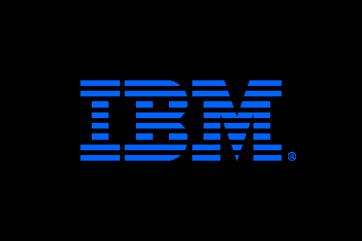

watsonx.governance

Hands On Lab

Govern AI Use Cases:

Use Case Request workflow

(short version)

Version 2.1

July 17th, 2026

**Document history**

|  |  |  |  |
| --- | --- | --- | --- |
| Version | Date | Author | Comments |
| 1.0 | June 19th, 2025 | Martijn Wiertz | First version published |
| 1.1 | June 27th, 2025 | Martijn Wiertz | Small edits after first use |
| 2.0 | April 9th, 2026 | Martijn Wiertz | Updated for workflow changes in OpenPages v9.2 |
| 2.1 | July 17th, 2026 | Martijn Wiertz | Edits after review and workshop use, updated for View changes in OpenPages v9.2.1 – shortened from full version |

**Table of Contents**

[Introduction 3](#_Toc235183456)

[Accessing the Governance Console on the EMEA cloud account 4](#_Toc235183457)

[Create a new use case 7](#_Toc235183458)

[Regulatory applicability assessment 14](#_Toc235183459)

[Risk identification 19](#_Toc235183460)

[Risk assessment 22](#_Toc235183461)

[Use case reviews 32](#_Toc235183462)

[Cleaning up the environment 38](#_Toc235183463)

[Summary 39](#_Toc235183464)

[Appendix – Assessment questionnaire answers 41](#_Toc235183465)

# Introduction

## Objective

The purpose of this hands-on lab it to understand in detail the *Use Case Request* workflow and all associated activities.

This is the start really of every good governance activity. By understanding the characteristics of the use case, you can define the appropriate risk and compliance controls. It gives important context for lifecycle of an AI system.

This is an important workflow in its own right, but this lab will also give you the knowledge that you can apply to “read” any workflow in watsonx.governance.

## Business context

For the purpose of this lab, image you are working for a global for-profit organization, headquartered in the US and also operating in various EU member states.

The AI system you will be governing is a self-developed internal version of a ChatGPT-like general-purpose AI assistant, using a private OpenAI model on Azure.

You are the business owner of that AI system. In that role, it is your responsibility to register this use case in watsonx.governance and guide it through the onboarding process. Amongst others, it will help establish which compliance and risk management measures need to be taken during the development and deployment of the intended solution.

## Software environment

This lab is written for the EMEA Showcase Account on watsonx.governance SaaS ([reservation page](https://techzone.ibm.com/collection/emea-watsonx-showcase) – for EMEA tech teams only).

If you use a different environment, your screens might look different.

As watsonx.governance evolves, the workflow(s) might also change and look/act differently.

## Complementary hands-on lab

This lab goes will with the “[Hands On Lab - Govern AI use cases - Compliance management](https://ibm.box.com/s/cii6d3pb0gpjaqvggqg8r2xwdtnpjq94#g-mb0l6buf)” hands on lab. They both use the same AI use case to highlight different governance processes.

# Accessing the Governance Console on the EMEA cloud account

## Option 1: from the watsonx homepage

* Log in to watsonx SaaS.
* Make sure you have the **2938525 – watsonx-showcase-emea** account selected. 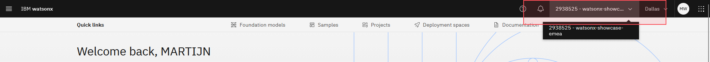
* Under the *Customize my journey* dropdown, select **Govern AI assets**. 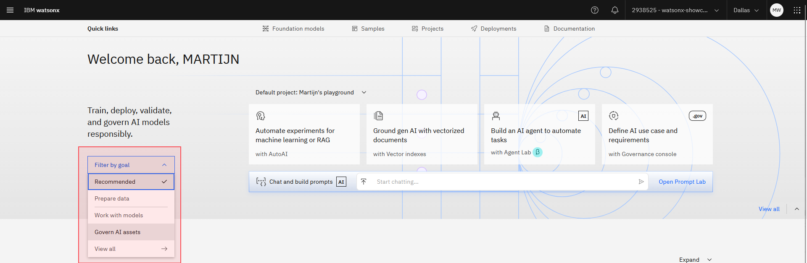
* Click on the **Manage AI risk and compliance** tile. 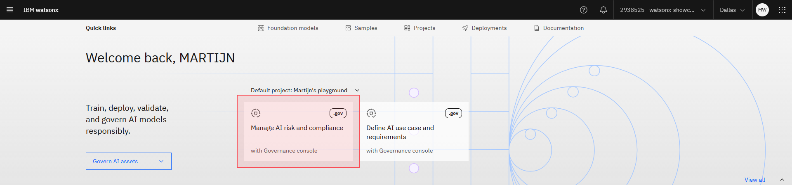
* This will open the Governance Console on its homepage.
* If you haven’t already, consider **bookmarking** this URL so you can go there directly.

## Option 2: from the IBM Cloud resource list

* After reserving the environment, and accepting the invitation from IBM Cloud to join the account, go to the IBM Cloud console: <https://cloud.ibm.com/> and log in.
* Make sure you have the **2938525 – watsonx-showcase-emea** account selected. 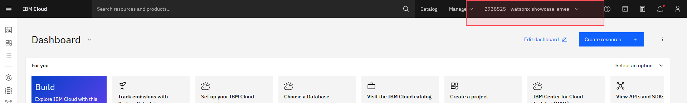
* From the left-hand menu, open the **Resource list**. 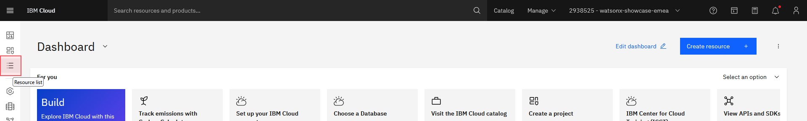
* Expand the **AI / Machine Learning** category, then click on the **openpages-showcase-emea-useast** resource. 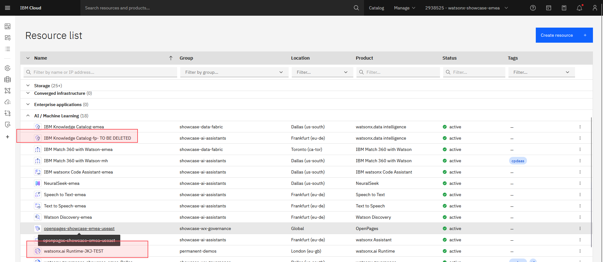
* Click on **Launch OpenPages**. 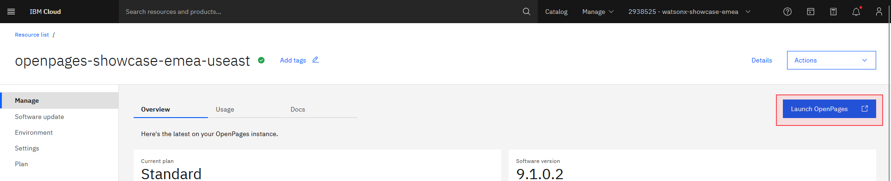
* This will open the Governance Console on its homepage.
* If you haven’t already, consider **bookmarking** this URL so you can go there directly.

## Check your user profile

* After you log in, open the **User menu** at the top right of the interface.
  + If your profile is set to “*watsonx-governance MRG Master*” you don’t have to do anything.
  + If not, then click on **Change Profile**. 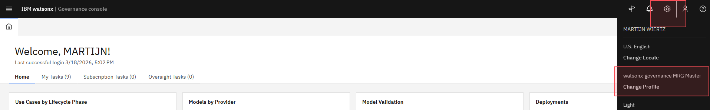
  + Select the **“watsonx-governance MRG Master”** profile and click **Save**. 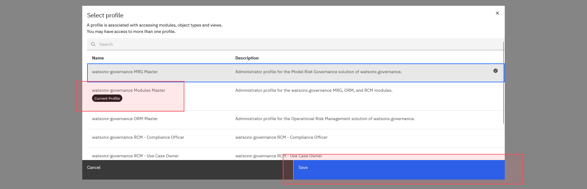
* You start on watsonx.governance’s homepage that looks like this: 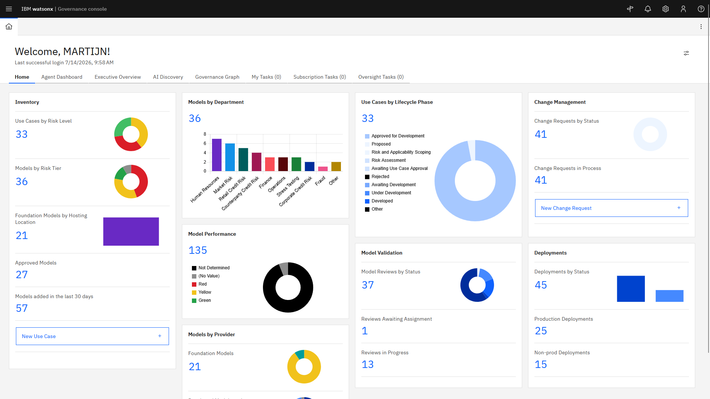
* This dashboard shows you information for your role as use case owner, and you can take action from here.

# Create a new use case

## Create a new use case

* In *Governance Console*, open the **main menu**, then select **Inventory 🡪 Use Cases**. 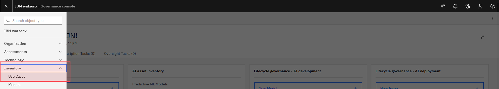
* On the *Use Cases* grid view, click on the **New** button. 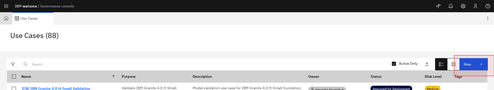
* On the *New Use Case* screen, notice the right-hand panel that guides the user through what needs to happen here.
  + **Expand and read** the guidance text
  + Under *All Key Items*, mandatory fields are marked with a red asterisk (\*). The other fields are recommended but not mandatory. 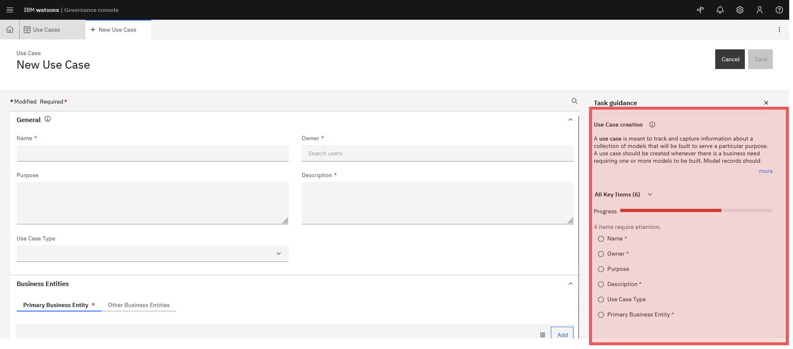
* Fill in the screen as follows:
  + *Name* = “AskMeAnything”+ your initials
  + *Owner* = your username
  + *Purpose* = “General purpose AI assistant for all of our employees”
  + *Description* = “AI chatbot with Q&A, summarization and RAG capabilities”
  + *Use Case Type* = AI
* In the *Business Entities* section of the screen, on the *Primary Business Entity* tab, Click on the **Add** button. 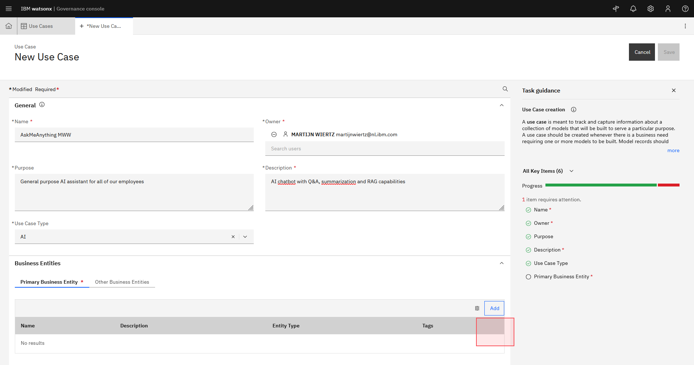
  + From the list of business entities, find and select “**High Oaks Bank**” and click **Done**. 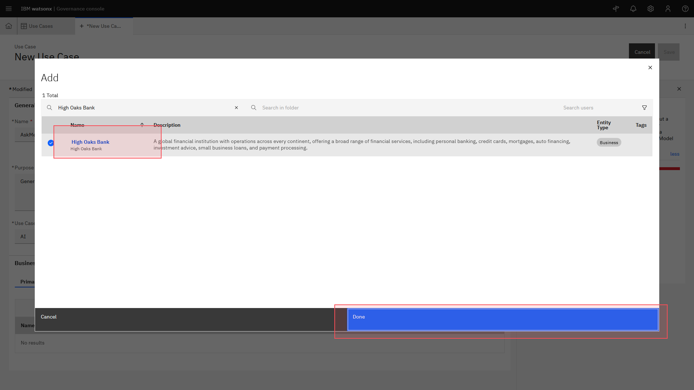
  + This selection determines the accountability of this use case – which department or business unit is responsible for this AI system?
* Back on the *New Use Case* screen, click on **Save**. 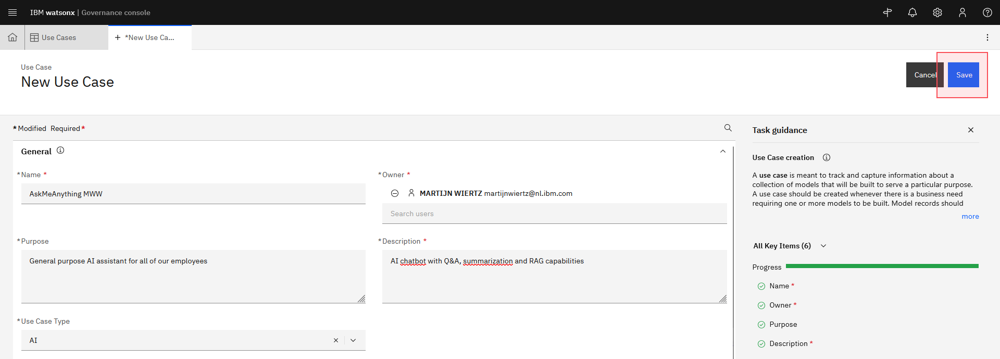
* Note the following fields have appeared on your use case:
  + Status = “Proposed”
  + Workflow stage = “Use Case Data Gathering (Data gathering)”
  + Due date = 5 days from now
  + Owner = you 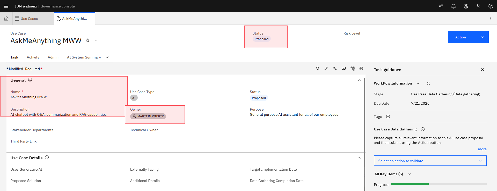
* Where does that come from? Those are all defined in the workflow. It’s outside of the scope of this session to dive deep into that.
* If the *Third Party Link* field is not yet set, **refresh** the screen to allow the Factsheet link to be populated automatically. You don’t need this link in this lab, but if you move ahead too quickly, you might get an error message in the next chapter of this lab. 

## Further use case data gathering

* Go back to the **tab with your use case**.
* Add your use case to your favorites so you can find it quickly. Click on the **star** next to the use case name. 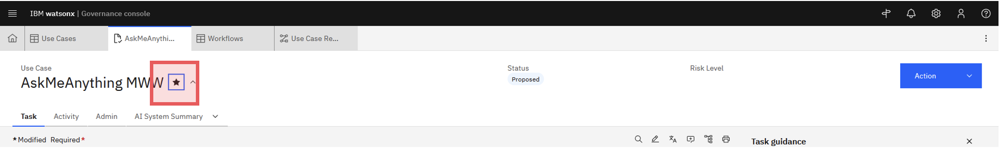
* In the *right-hand panel*, you can see some new recommended fields. Let’s fill those in (you can click on the name of the field in the guidance panel to jump to that field on the UI):
  + *Stakeholder departments* = Information Security, AI Committee
  + Technical owner = your username
  + Risk level – leave this field blank for now, we’ll come back to it later 
* **Save** your use case. 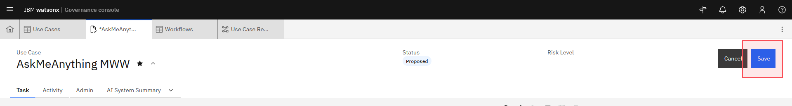
  + If you get an error “The object has been recently updated by another user”, refresh the screen and enter the information again
    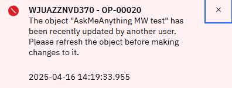
  + This is caused by the automated action to populate your use case with the Factsheets link. If you did the refresh action earlier in this lab, you would have already avoided this message, but in demos you might be moving quicker than the tool 😉
* Click on the **Action** button, then click on **Send for risk and applicability scoring**. 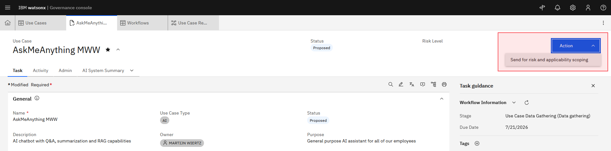
* On the confirmation screen, click on **Continue**. 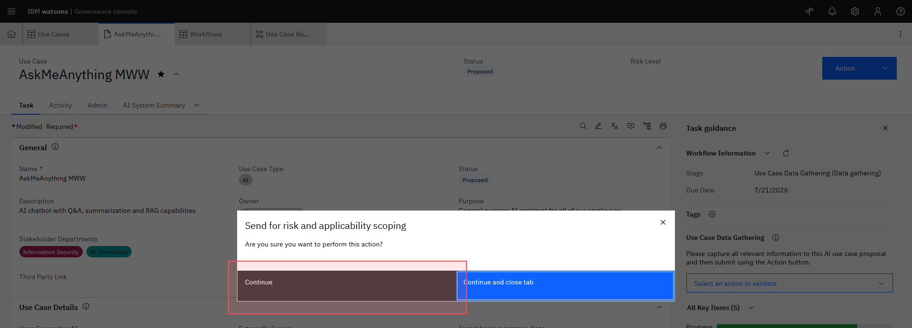
* Once again, the workflow has taken certain actions. Note the following on your use case:
  + *Status* has changed to “Risk and Applicability Scoping”.
  + *Workflow stage* has changed to “Risk Identification and Applicability ”.
  + The *Data Gathering Completion Date* field has been set to today’s date.
  + The use case is *assigned to you* in this stage of the workflow.
  + A new *Risk* section has been added to the use case view, with an assessment questionnaire.
  + A new *Regulatory Information* section has been added to the use case view, with an assessment questionnaire.
* Before we continue with our use case, let’s first have a quick look at the automated audit trail.

## Audit logging

* Click on the **Activity** tab. 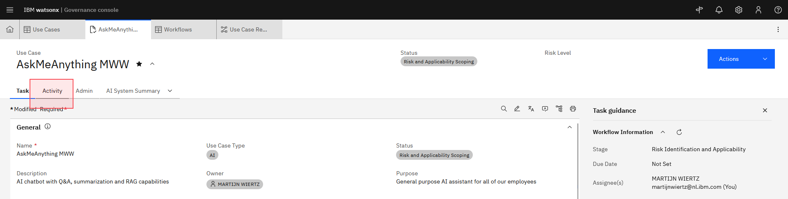
* Here, the software automatically captures an audit trail for your use case.
* At the top you will see your most recent changes such as the changes to the *Status*, *Data Gathering Completion Date* and *Workflow Stage* fields. 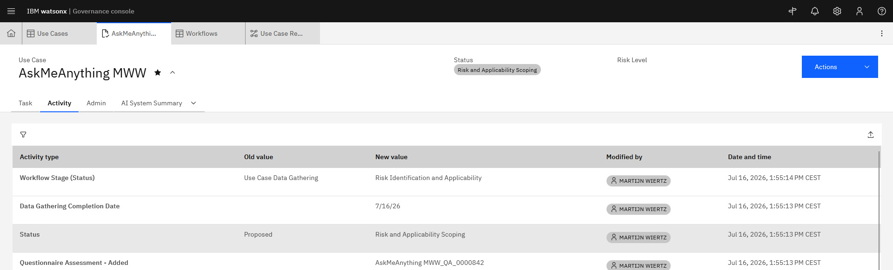
* All of these entries are automatically logged with the name of the user and a date/timestamp.
  + This data is immutable, it is not changed or deleted. Even if the user in question is no longer active (for example because they switched roles, or left the organization), their activities will still be visible here for audit purposes.
* Over time, this audit trail can get quite long, so you have the ability to filter this list. Open the **Filter** side bar. 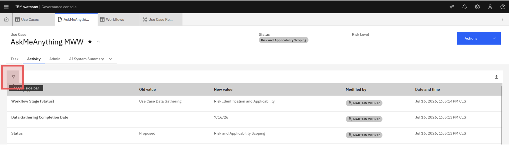
* Here, I can filter by date, user, or specific types of changes.
* Select the **Workflow** filter. 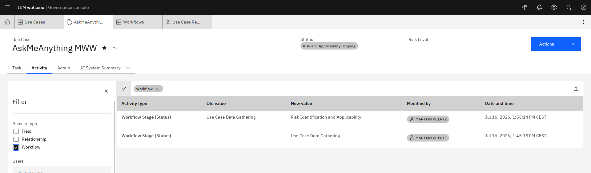
* As a result, I now only see the workflow transitions that this use case has gone through.
  + Right now, we have just started the onboarding process, so you only see two workflow transitions here. Throughout this lab, feel free to come back to this tab to see what is captured here along the way.

# Regulatory applicability assessment

## Fill in the questionnaire assessment

* Go back to the **Task** on with your use case.
* In the *Regulatory Information* section of your use case, notice that the EU AI Risk Category is set to “Not Determined”. 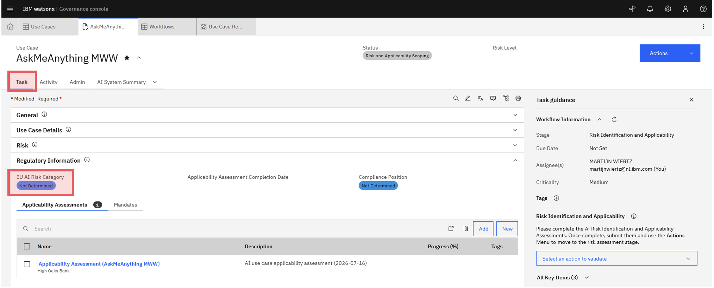
* Each assessment that is created is a child object of the use case. The Questionnaire Assessment object is subject to a workflow of its own, separate from the Use Case Request workflow. 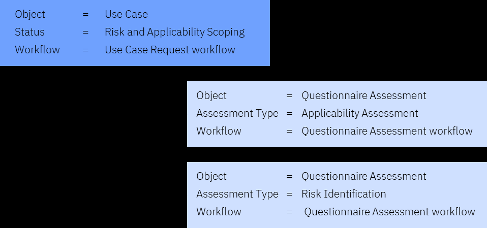
* To help us categorize our use case, click on the questionnaire assessment called **Applicability Assessment (AskMeAnything ABC)** to open it.
* The questionnaire consists of a few sections. The first section is *Scope and Prohibited AI Systems* (1).
* The first part of that consists of 3 questions, of which none have been answered yet (the question counter (2) shows 0 / 3 completed). 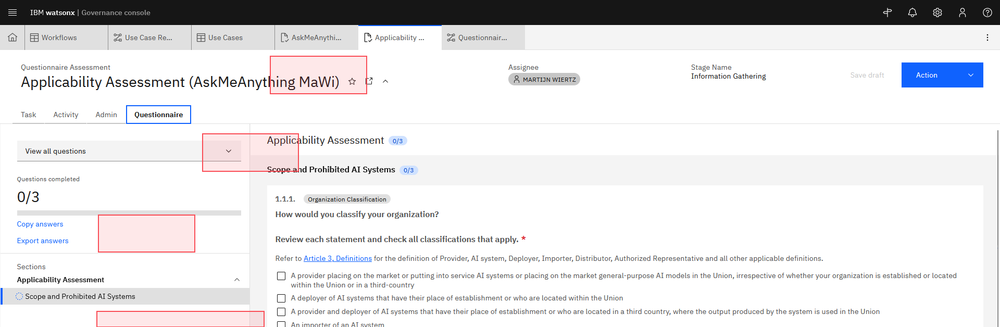

**1**

**2**

* + **Read the questions and fill in the answers**. Use the information from the Business context paragraph of this document if you need clues about the appropriate answers. Ask your course leader to clarify anything that is unclear.
* If you answered the first three questions correctly, the questionnaire determines that your AI system is *in scope of the AI Act*, and a set of additional questions appear. 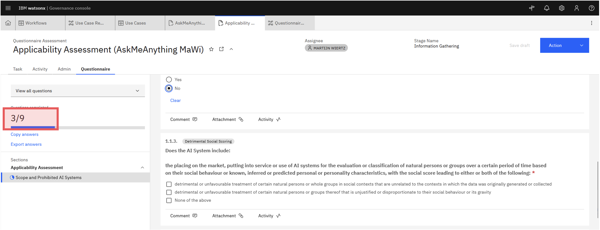
  + **Read the questions and fill in the answers**. Use the information from the Business context paragraph of this document if you need clues about the appropriate answers. Ask your course leader to clarify anything that is unclear.
* If you answered these next 6 questions correctly, the questionnaire determines that your AI system is *not Prohibited*, a new questionnaire section called “Category Assessment” appears in left hand panel.
* Click on that **section name**. 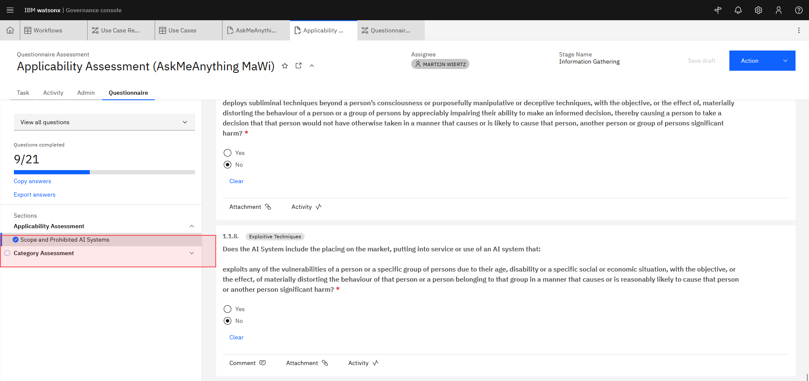
  + **Read the questions and fill in the answers**. Use the information from the Business context paragraph of this document if you need clues about the appropriate answers. Ask your course leader to clarify anything that is unclear.
* After completing all the questions, you will get a final notice that your use case may be subject to *transparency requirements* in the AI Act, and you are asked to contact the compliance department. Click the “I confirm” button. 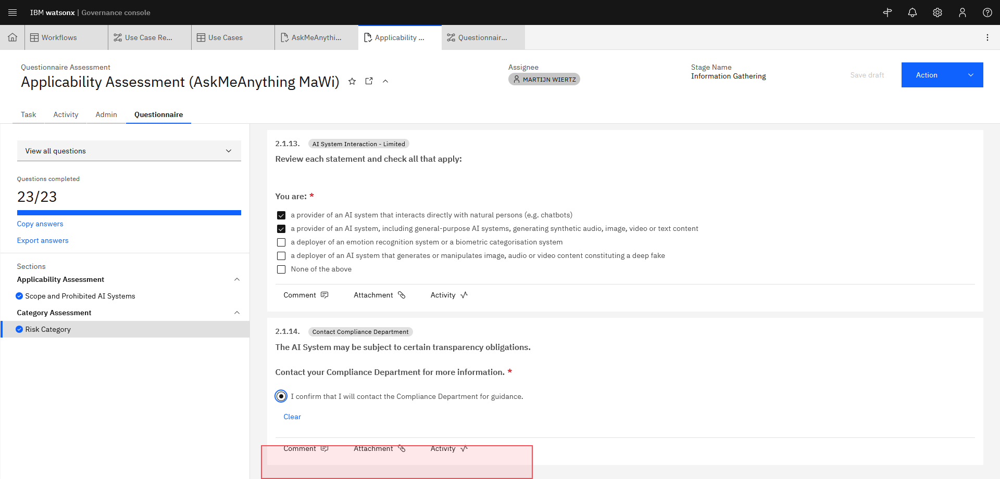
* If your outcome is different, you probably have answered some questions differently. That’s OK for this exercise, no need to go back and change anything.
* In total, you have answered 23 questions. 
* The questionnaire with your answers is periodically auto saved. If the *Save draft* button is not greyed out, **click on that button** to make sure your final answers have been saved. 
* You have now completed and saved the applicability assessment. Click on the **Action** button, then select **Submit and Close**. (as expected from the Action properties you just saw). 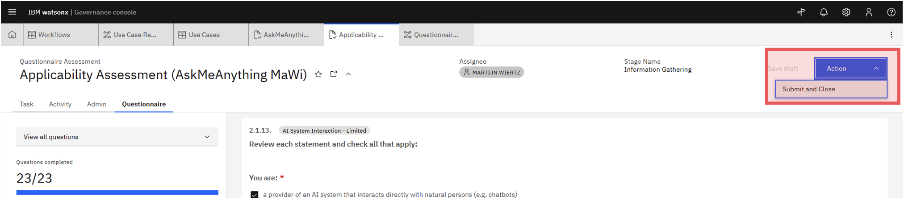
* On the confirmation screen, click **Submit and close tab**. 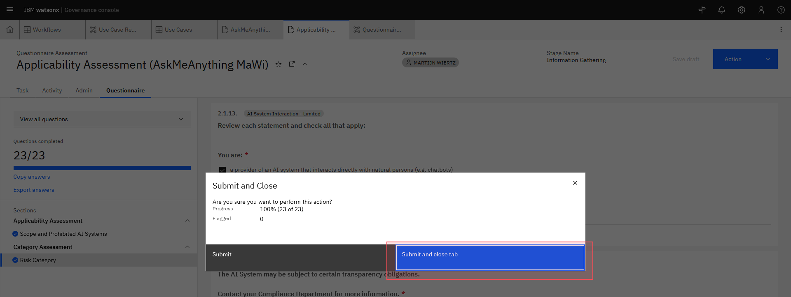
* Go back to the **tab with your use case**.
* In the *Regulatory Information* section, notice that the *EU AI Risk Category* field is now set to “Limited”. 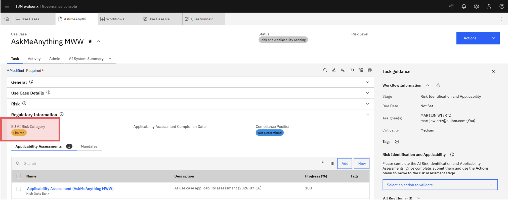
* Where does that come from? The questionnaire template contains decision logic that sets this field, based on the answers you’ve given.
* In graphical form: 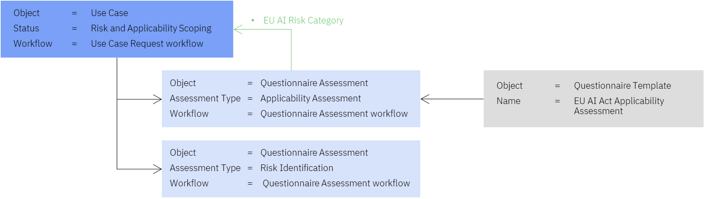
* Next, you will go through the same process with the Risk identification assessment.

As a side note: there is a logical link here to the Compliance Accelerators. Now that you know that your use case is not prohibited, not high-risk, but *does* have transparency requirements, you could select the appropriate compliance plan from the library to understand what specific obligations you now have for your use case. This functionality is covered in the “Hands On Lab - Govern AI use cases - Compliance management” Lab which you can find on <https://ibm.biz/SellWatsonxGovernance>.

# Risk identification

This chapter is similar in structure to the previous one. The instructions are a little more compact since you are doing this for the second time now. Refer back to the previous chapter if you need a memory jog.

## Fill in the questionnaire assessment

* Go back to the **tab with your use case**.
* In the *Risk* section of your use case, click on the questionnaire assessment called **AI Risk Identification (AskMeAnything ABC)** to open it.
* Fill in the risk identification questionnaire. Use the information from the Business context and [Create a new use case](#_Create_a_new) paragraphs of this document if you need clues about the appropriate answers. Ask your course leader to clarify anything that is unclear.
* As you work through the questionnaire, notice that
  + You can be asked to provide a comment on a question
  + You can be prompted to answer additional questions
* In the questionnaire I created when writing this content, I have answered 31 questions (you might have a different number based on the answers you’ve given). 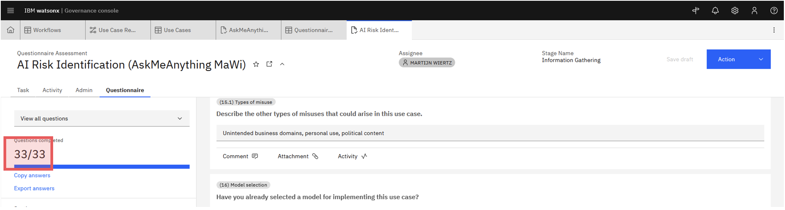
* The questionnaire with your answers is periodically auto saved. If the *Save draft* button is not greyed out, **click on that button** to make sure your final answers have been saved. 
* You have now completed and saved the risk identification. Click on the **Action** button, then select **Submit and Close**. 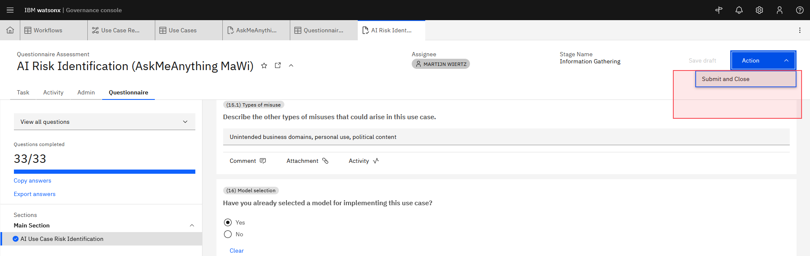
* On the confirmation screen, click **Submit and close tab**. 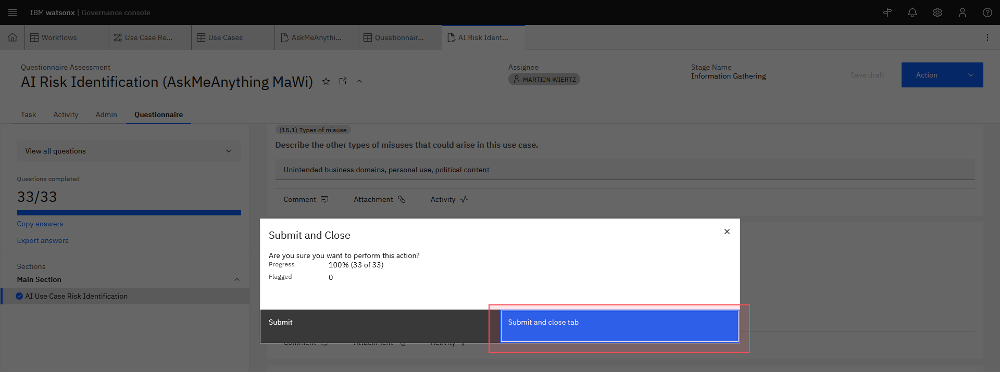
* Now that we have described our use case in detail, the next step is to *assess* the risks that have been identified from your answers.

## Continue the Use Case Request workflow

* Go back to the **tab with your use case**.
* Click on the **Action** button, then click on **Submit for Risk Assessment**. 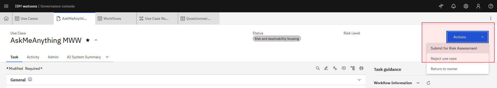
* On the *confirmation screen*, click **Continue**. 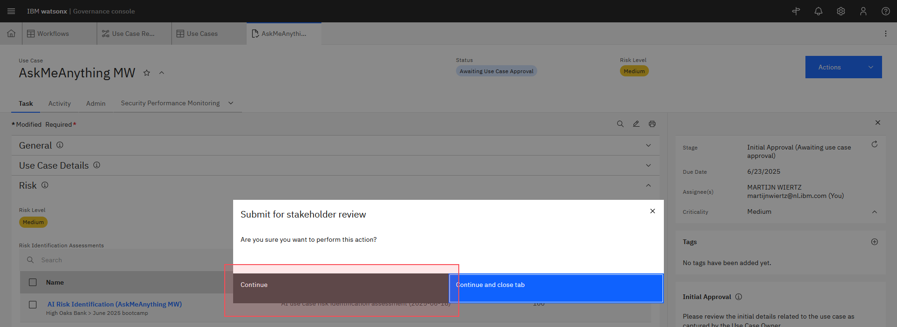
* In the *Risk* section of your use case, notice that a number of risks are added to your use case (the exact number of risks and which ones, depends on how you answered the questionnaire). 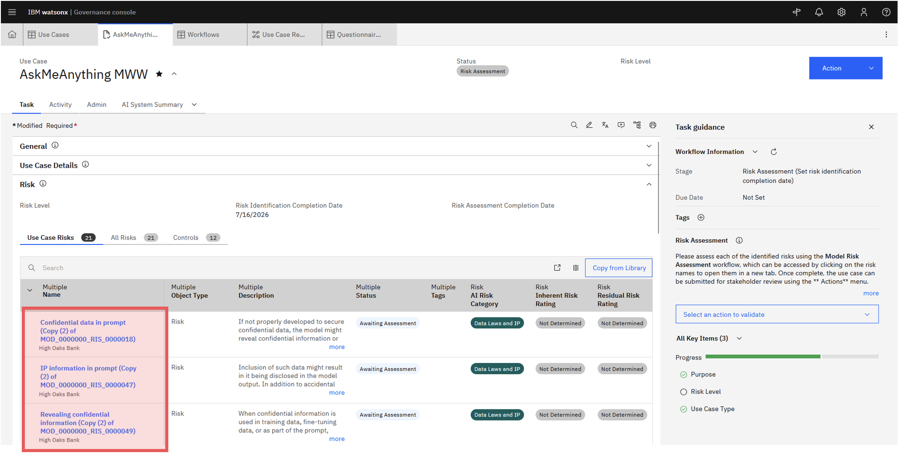

# Risk assessment

## Assess a risk

* In the *Risk* section, for the *table of Risks*, click on the **Launch Grid page** icon to display the list of risks in a separate tab. 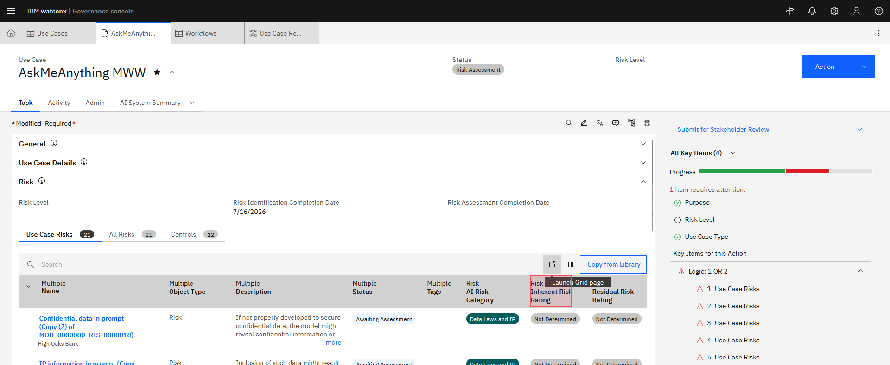
* Click the **name** of the first risk in your list to open it. 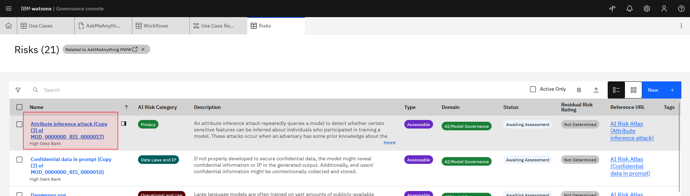
* Read the **description** of the risk. 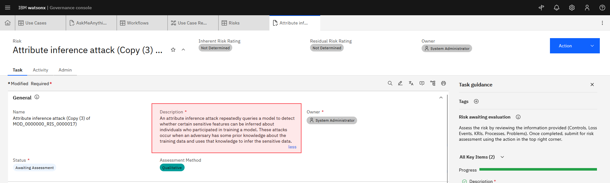
* Notice that
  + The *Inherent Risk* and *Residual Risk* fields are both set to “Not determined”
  + The *Status* field is set to “Awaiting Assessment” (as per the Response action)
  + In the *Risk Categorization* section, the *Domain* field is set to “AI / Model governance”.
    - This field is set on the Risk object in the library. When the Risk is copied to your use case, it maintains that categorization.

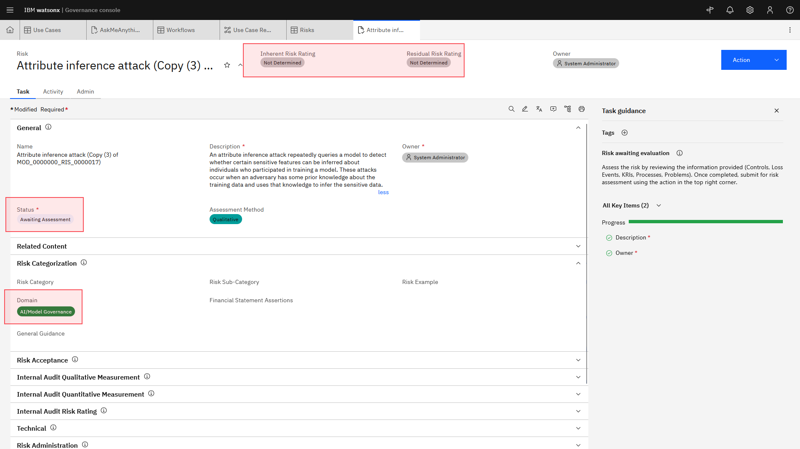

* From the **Action** button, select **Start Model Risk Assessment**. 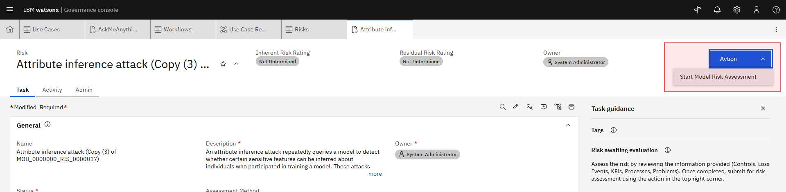
* On the *confirmation screen*, click **Continue**. 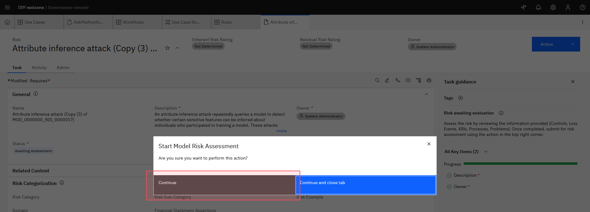
* You have now initiated the assessment workflow, you are the owner of this Risk object, and the Risk is placed in the *Confirm Assignment* workflow state. 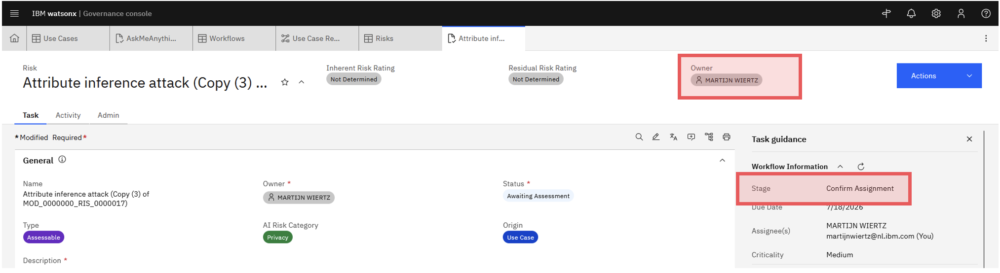
* We will work through this activity in its entirety first, and then have a look at the workflow that drives this.
* Read the instruction in the right-hand panel.
  + You are asked to confirm that you are the owner, or re-assign the Risk to someone else. You will continue as the owner yourself. 
* Open the **Action** button, but do not select any of the options yet. 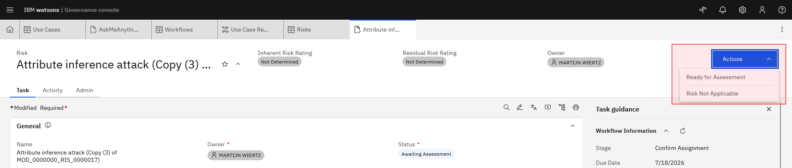
* Notice that you have two options:
  + “Ready for assessment” – this confirms that you are the owner and you want to start the assessment process
  + “Risk Not Applicable” – this means that you are owner, but you don’t think the risk is applicable for this use case. Remember that the risk was auto-populated based on the questionnaire responses, but on closer inspection, it might not be relevant after all.
* Click on the **Ready for Assessment** option. 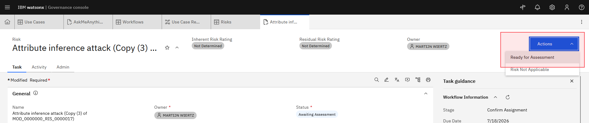
* On the *confirmation screen*, click **Continue**. 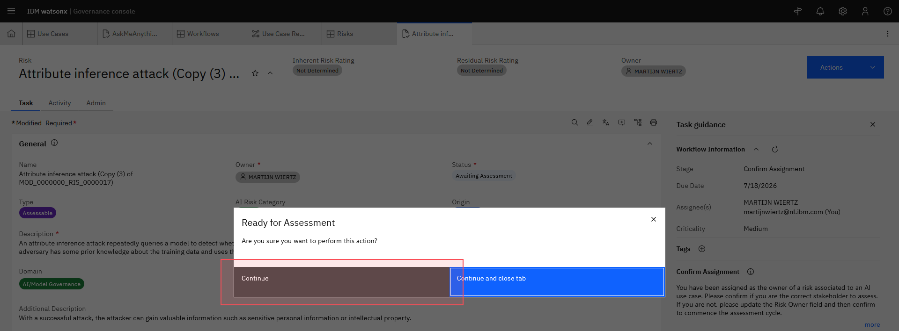
* The Risk is now in the *Perform Risk Assessment* workflow stage.
* Read the instruction and the Key Items in the right-hand panel. 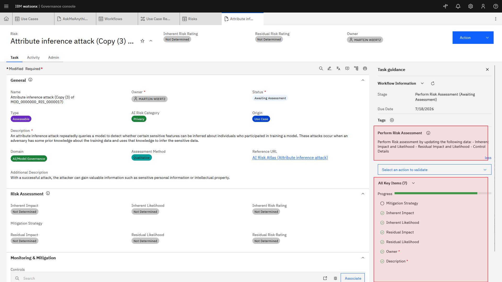
* Some definitions to help you with this task:
  + Inherent likelihood = How likely is it that this risk occurs *if you do not* take any mitigating actions?
  + Residual likelihood = How likely is it that this risk occurs *after you’ve taken* mitigating actions?
  + Inherent impact = If the risk occurs, how big is the impact (financial, reputational etc.) *if you do not* take any mitigating actions?
  + Residual impact = If the risk occurs, how big is the impact (financial, reputational etc.) *after you’ve taken* mitigating actions?
  + These are well-known risk management concepts.
* In the *Risk Assessment* section, update the field *Inherent Impact* to **Medium**. 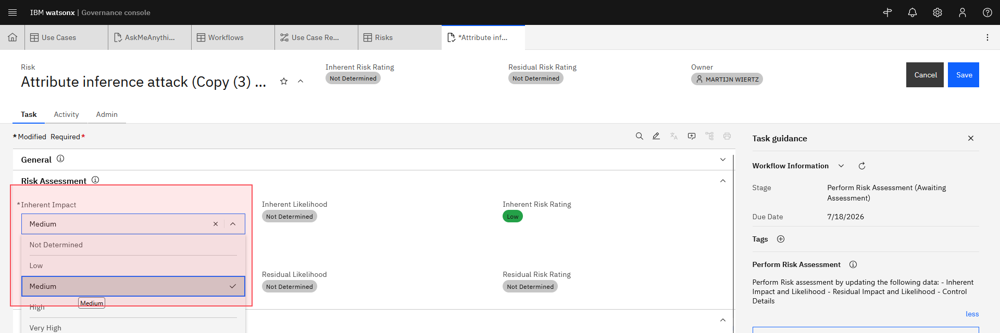
* Update the field *Inherent Likelihood* to **High**. 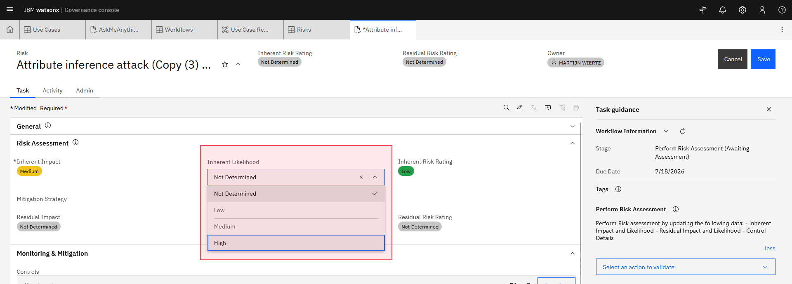
* Notice that the field *Inherent Risk Rating* is automatically updated based on your inputs. This is an automated calculation that combines the *Likelihood* and *Impact* assessments into a single rating. 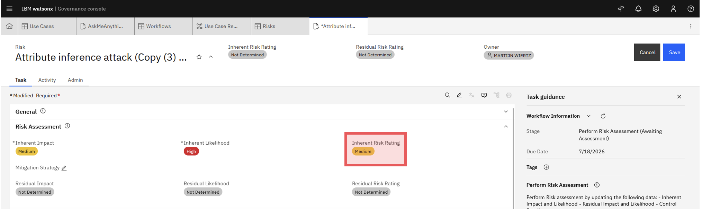
* In the *Key Items* list in the right hand panel, you are also asked to describe the *Mitigation Strategy* – what is your plan to reduce or even remove this risk?

The answer here of course depends on the specific risk on which you are working. In my screenshots I am working on the “Attribute inference attack” risk. For this risk, my strategy might be to “Implement a guardrail that detects behavior that would indicate an attribute inference attack.”.

* Enter an appropriate **text** for your risk in the *Mitigation Strategy* field. 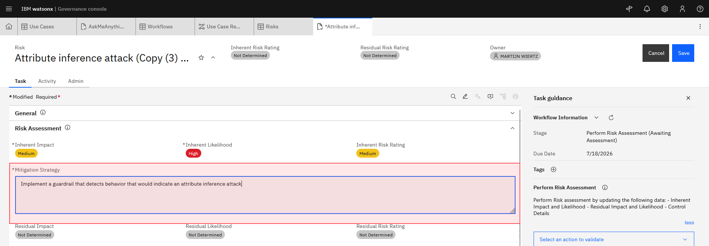
* After you’ve done that, notice that in the *Key Items* list, this field now gets a green completion mark. 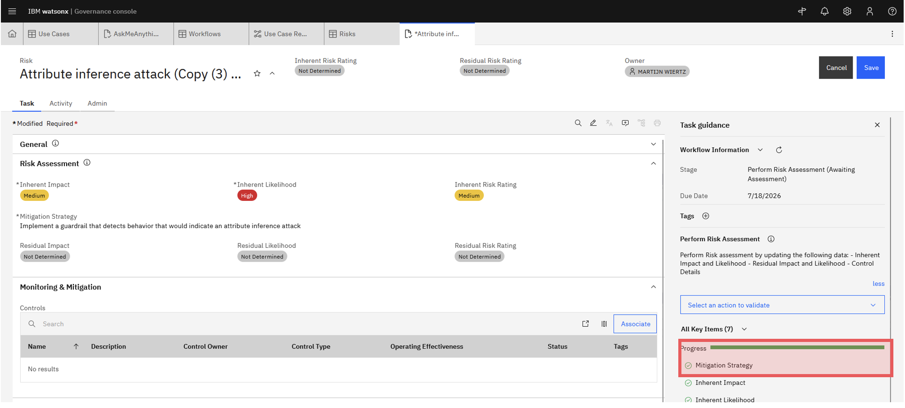
* Update the field *Residual Impact* to **Low**.
* Update the field *Residual Likelihood* to **Medium**. 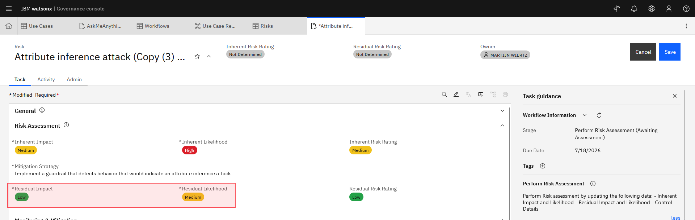
* Notice that the field *Residual Risk Rating* is automatically calculated based on your inputs.
* **Save** the information that you have entered. 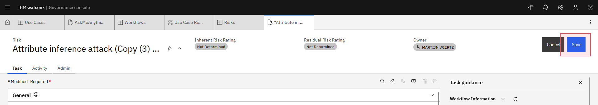
* Under the **Action** button, select **Assessment Complete**. 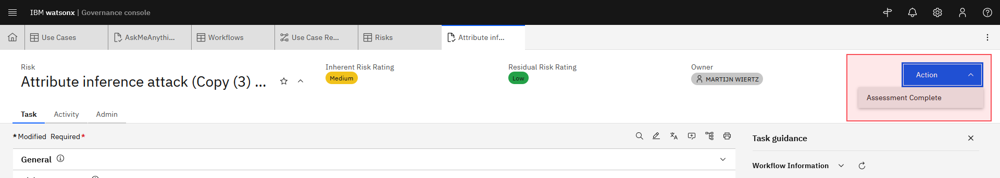
* On the *confirmation screen*, enter a **Comment** of “I have assessed the risk. The suggested mitigation strategy is expected to reduce the Residual Risk Rating to Medium.”, then click on **Continue**. 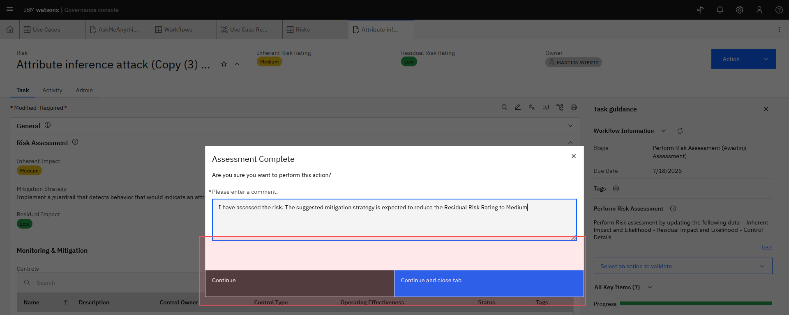
* Notice the following:
  + The *Status* field is set to “Approved”.
  + Your *workflow comment* is saved with a date stamp and your username appended. 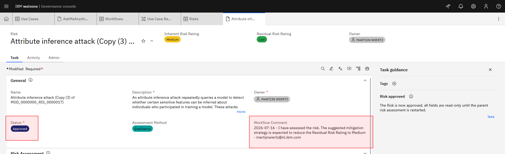
* As mentioned, there is another dedicated workflow that drives this. Let’s have a look at that one.
* **Close** the tab with the Risk you have just assessed.
* **Do not close** the tab with the list of Risks from your use case.

## Complete the assessment for all risks

Depending on how your answered the risk identification questions, you might have quite a long list of Risks to work through. For simplicity in this lab, consider:

* Doing 2 or 3 risks purposefully: seriously consider the likelihood and impact fields and come up with a realistic mitigation strategy.
  + Open the Risk object
  + Action button 🡪 Start Model Risk Assessment 🡪 Continue
  + Action button 🡪 Ready for Assessment 🡪 Continue
  + Set *Inherent Impact* and *Inherent Likelihood* fields
  + Enter a text for *mitigation strategy*.
  + Set *Residual Impact* and *Residual Likelihood* fields
  + Save
  + Action button 🡪 Assessment Complete
  + Enter a comment, Continue and close tab
* After doing this a few times:
  + Go to the tab that shows the **Risks for your use case**.
  + **Select** all the Risks you have not yet worked on, and click on **Bulk Update** in the toolbar. 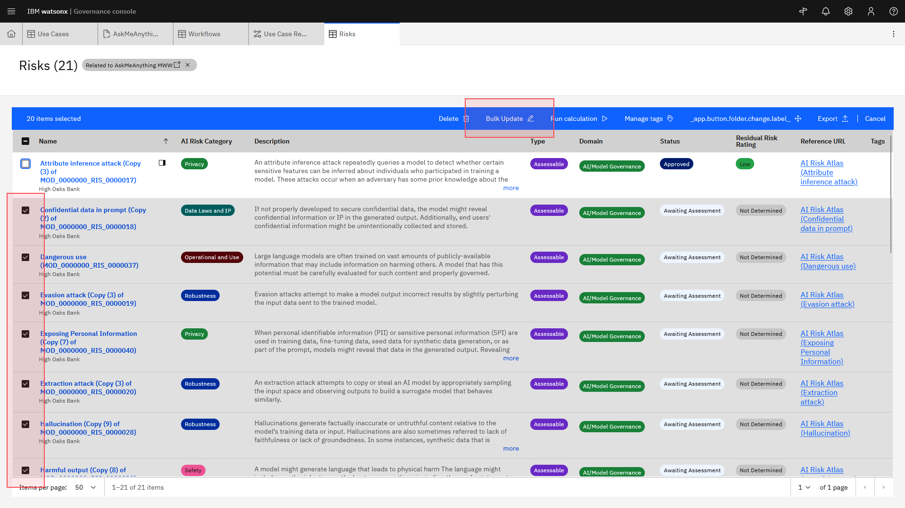
  + In the *Bulk Update* panel, select the field **Status** and set the value to **Approved**, then click on **Update**. 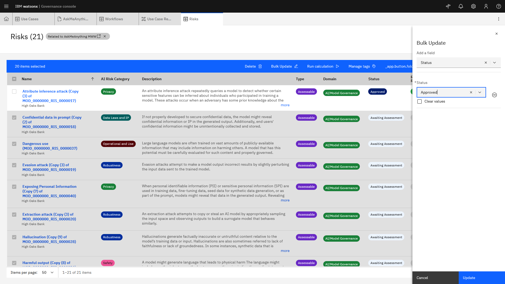
  + On the *Confirmation* screen, select **Confirm**. 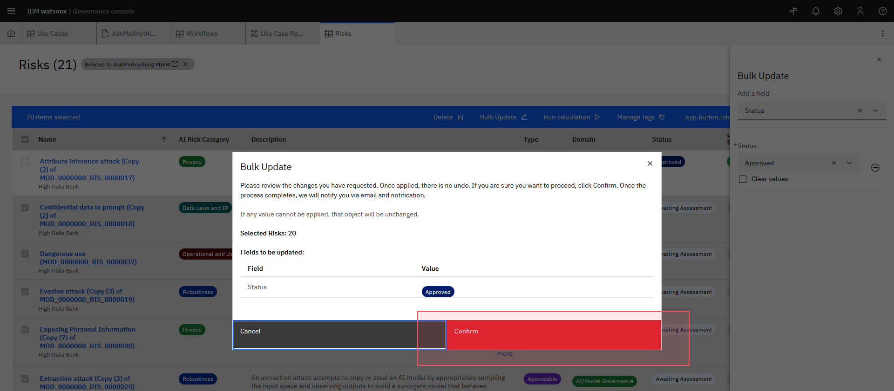
  + After a few seconds you will get this notification screen: 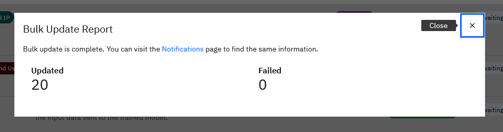
  + This batch approach is not a recommended approach in real life.
* When all Risks are assessed, close the tab that shows the **Risks for your use case**.

## Continue the Use Case Request workflow

* Go to the tab that shows **your use case**.
* We can now move on from the *Risk Assessment* stage of the workflow.
* On the **Action** button, click on **Submit for stakeholder review**. 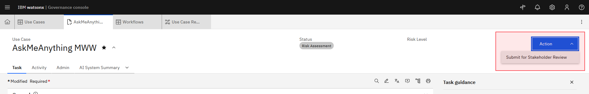
* On the *Confirmation* window, click on **Continue**. 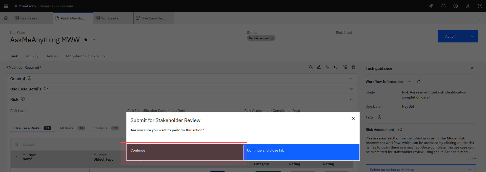
* Notice the following on your use case:
  + *Status* = Awaiting Use Case Approval
  + *Workflow stage* = Stakeholder Review
  + You are still the *assignee*
  + The *due date* is 5 days from now
  + Two reviews have been added in the *Use Case Approval* section. 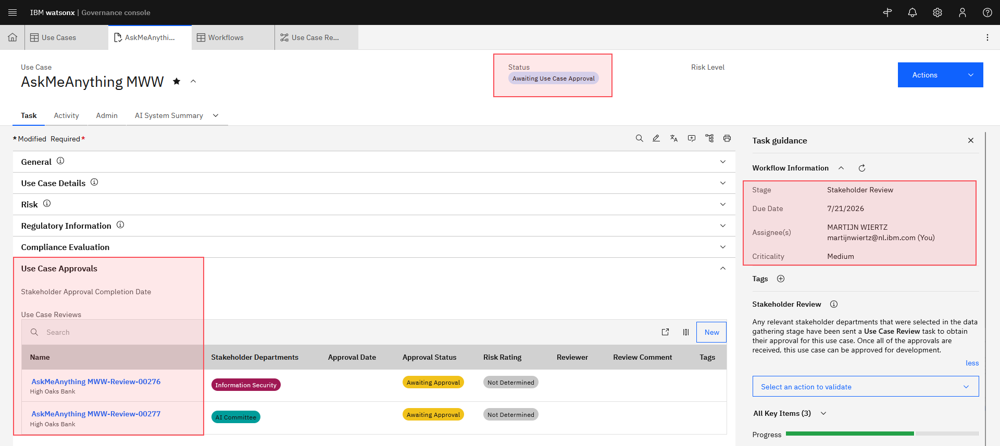
* Let’s have a look at these reviews next.

# Use case reviews

## Complete the stakeholder reviews

* First of all, note that there are two Review objects, one for each Stakeholder Departments that you set in the early steps of this Lab. Both are in an “Awaiting Approval” status. 
* Each Stakeholder Review that is created is a child object of the use case. The *Stakeholder Review* object is subject to a workflow of its own, separate from the Use Case Request workflow. 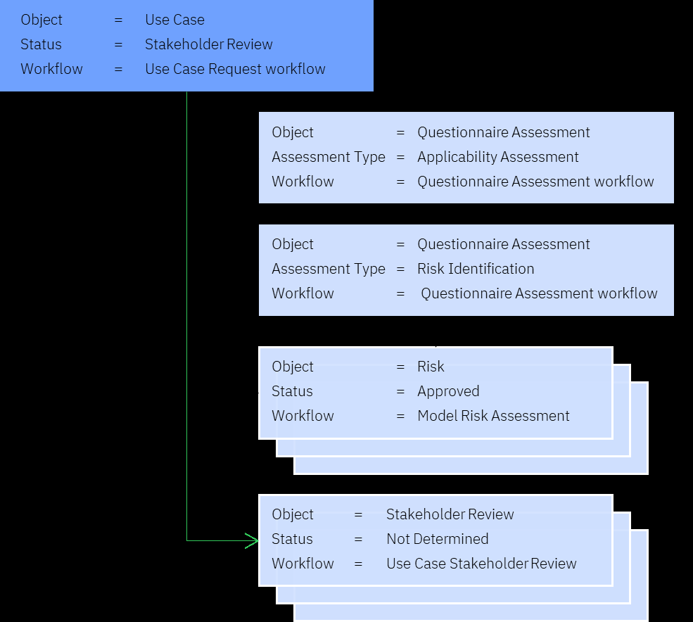
* From the *Use Case Approvals* section, open the **Review for the Information Security** department. 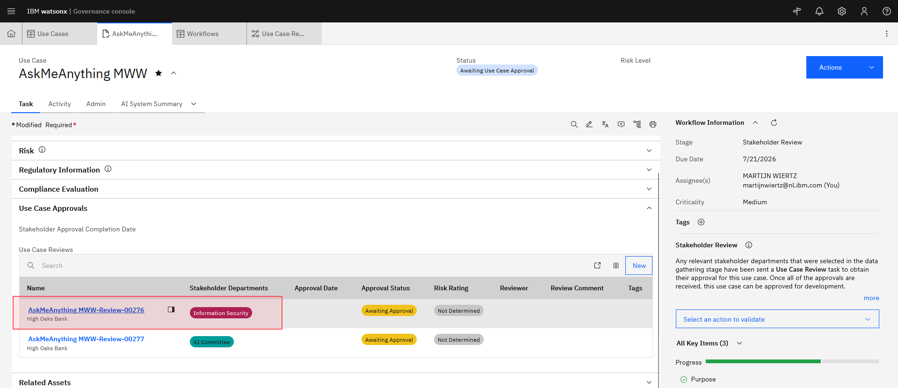
* Expand the *workflow information* panel to see that
  + This Stakeholder Review is in the *Awaiting Approval* lifecycle stage.
  + It is **not assigned** to anybody yet. 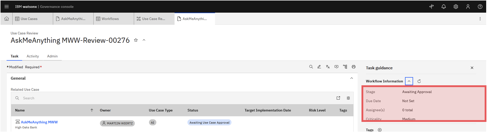
* Depending on a customer’s setup, this could be automatically assigned to a person or a role, but that’s not set in the out-of-the-box configuration.
* As the use case owner, you can assign this to someone. For simplicity, assign yourself. In the *Reviewer* field, select **yourself**, then **Save** the information. 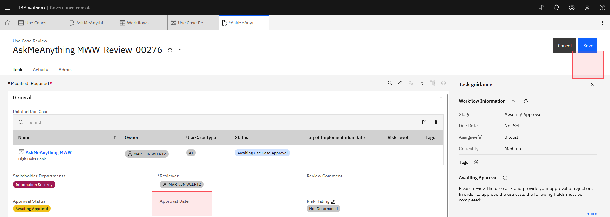
* You are now the assignee, and the workflow’s Action button is enabled. 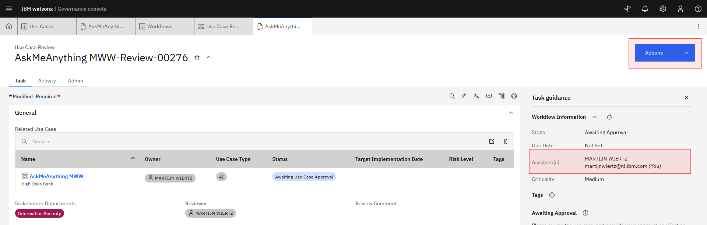
* On this task view, you can access the *Use Case* (1) and both of its *assessments* (2) for more information. If there were any *documents* attached to the use case, you would see those as well (3) to help with your review. 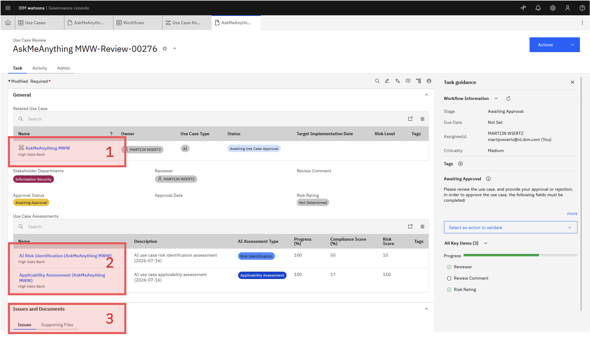

**1**

**3**

**2**

* Let’s assume you have done all of that, and are happy with the information provided and want to approve the Use Case.
* In the *Reviewer Comment* field, enter a **comment** that states your approval, then **Save** the information. 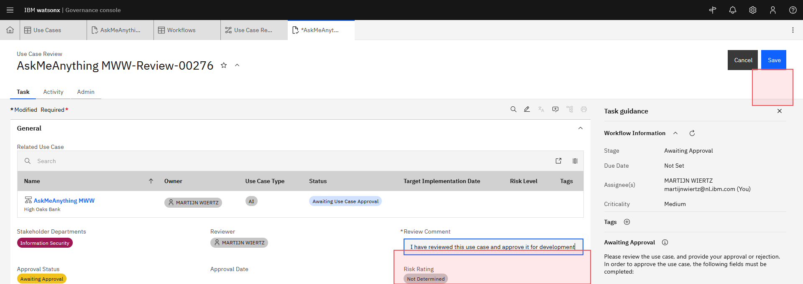
* You have now completed all three fields under the *Key Items* list
* Click on the **Action** button, then select **Approve Use Case**. 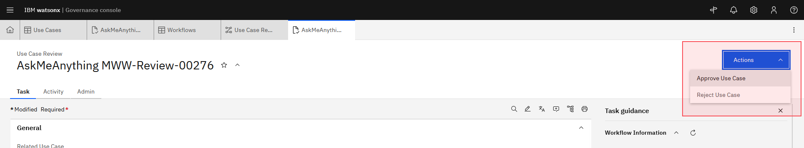
* On the *Confirmation* screen, select **Continue and close tab**. 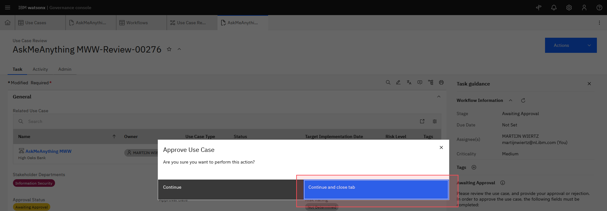
* You should get a message like this: 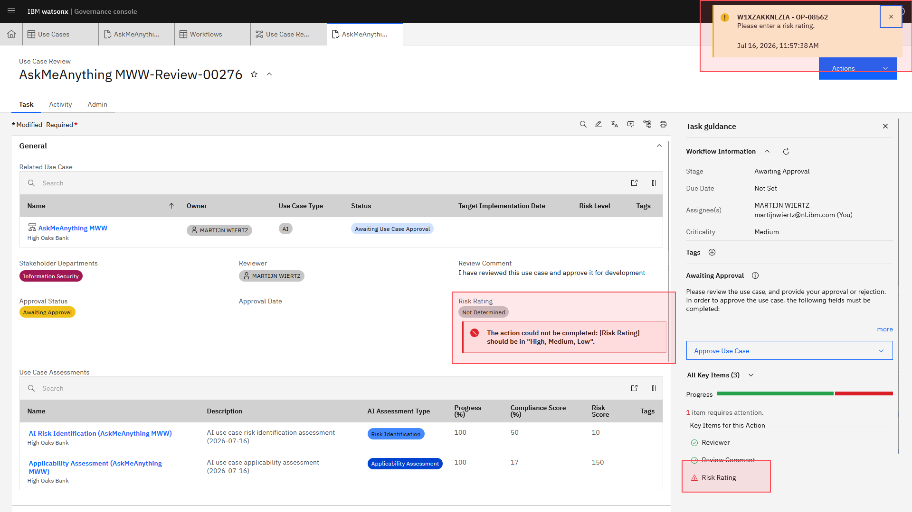
* This wasn’t immediately obvious in the UI anywhere, but there is a built-in check that the *Risk Rating* field has been set.
* Change the *Risk Rating* field to **Low**, then **Save** the information. 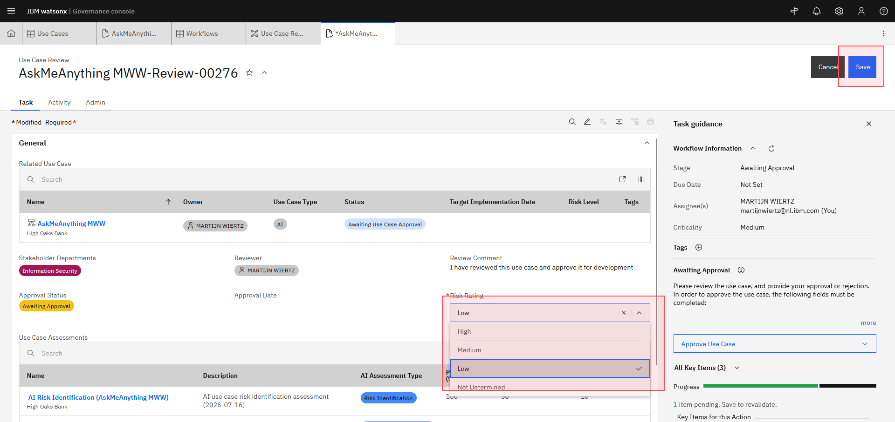
* Click on the **Action** button again, then select **Approve Use Case**.
* On the *Confirmation* screen, select **Continue and close tab**.
* Back on your Use Case screen, for this first Stakeholder Review the Approval Status is now set to
  “Approved”, and the *Approval Date* field is set to today’s date. 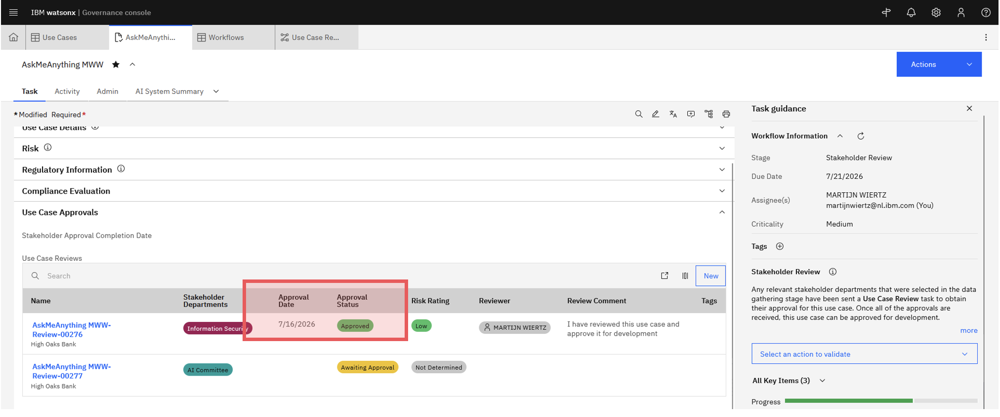
* Like before, you have again seen various automated actions and checks on this Stakeholder Review. And like before, there is a workflow that drives this. Let’s see where this happens.
* Complete the **second Stakeholder Review** in the same way as the first one.
  + Don’t forget to set the risk rating

## Continue the use case request workflow

* With all Stakeholder Reviews done, click on the **Action** button, then select **Approve for development**. 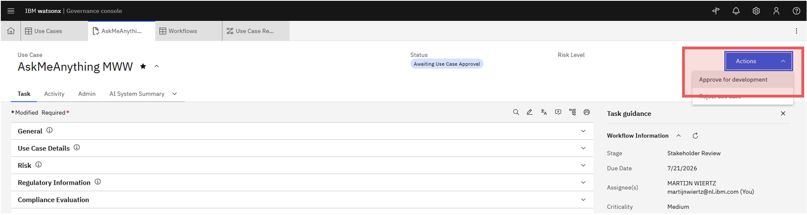
* On the *Confirmation* screen, select **Continue**. 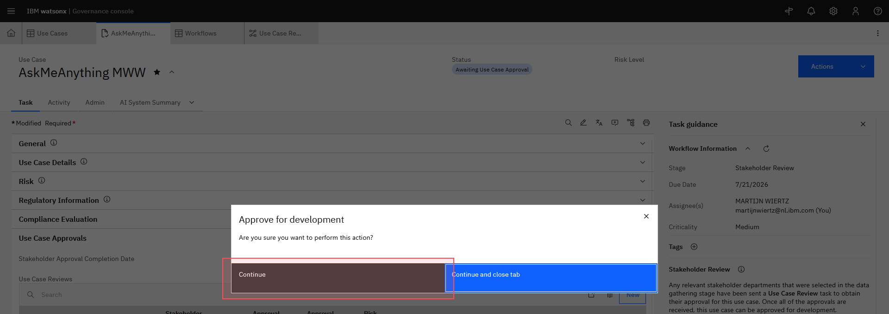
* Back on the *Use Case* screen, the *Status* field is now set to “Approved for Development”. 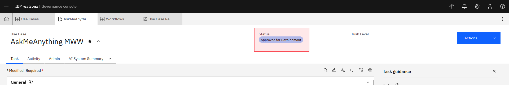
* That completes the *Use Case Request* workflow.
* If you are completing this Lab on a shared environment, please follow the steps in the next chapter to remove your use case.
* After that, read the summary chapter.

# Cleaning up the environment

* Go to the tab showing the **list of registered use cases**.
* In the search bar, enter **your initials or other identifier** for your own use case.
* Your use case is not active at the moment, since you completed the entire workflow and have not started a new one.
* **Unselect** the **Active Only** checkbox to the right of the search bar. 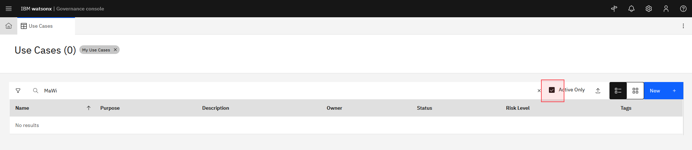
* Your use case should now be in the list
* Tick the **selection box** to the left of your use case’s name, then select **Delete** from the toolbar. 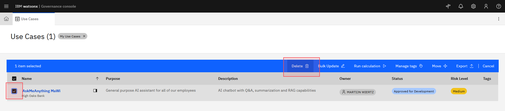
* This will automatically also delete all the associated objects such as assessments, risks and reviews.
* Done!

# Summary

Congratulations on completing this long lab! You covered the entire *Use Case Request* workflow from start to finish, including all the child objects with their respective workflow.

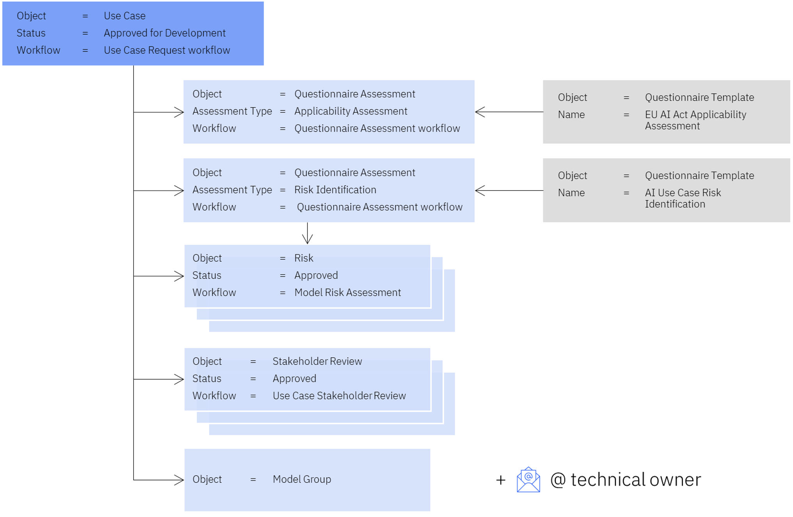

Along the way, you have seen how the different elements of a workflow can be used to codify an organization’s governance processes and policies:

|  |  |
| --- | --- |
| Workflow properties | * (De-)activate workflows. * Implement how the workflow starts. * Implement the rules that describe when a workflow applies, for example to limit the workflow to instances of an object with a specific status value.   + This can help break up a large process into smaller workflows.   + This can help differentiate between objects with different characteristics (e.g., high-risk vs low-risk use cases, or ML vs. gen AI assets) |
| Action properties | * Define the label that will be visible under the Action button. * Send notification emails to users that are assignees or subscribers. * Implement conditional routing through a workflow. * Implementation validation rules on data entry (with appropriate warning messages). * Implement automated operations to:   + Set fields such as *Status* or *Completion Date*.   + Create new child objects such as a *Questionnaire, Review* or *Model Group.*   + Run questionnaire response actions. |
| Stage properties | * Set a due date for a task. * Assign a task to the right person or role. * Send notification emails for workflow end stages. * Implement automated operations on workflow end stages. |

In conjunction with the workflow, the questionnaire templates also play a role in codifying an organization’s governance processes and policies:

* Define conditional routing through the questionnaire
* Define response actions to
  + Set fields such as the *EU AI Risk Category* field.
  + Create or copy new child objects such as Risks.

Lastly, there is an interplay between workflows and Views. This topic was out of scope for this lab.

# Appendix – Assessment questionnaire answers

This appendix lists the questionnaire answers I entered while writing this lab.

Depending on your understanding of the use case, you might make different choices.

## Applicability Assessment

In the *Scope and Prohibited AI Systems* section:

* 1.1.1. Organization Classification = A provider and provider of AI systems that…
* 1.1.1.1 Excluded AI Systems = None of the above
* 1.1.1.2. Excluded AI Systems = No
* 1.1.3. Detrimental Social Scoring = None of the above
* 1.1.4. Law Enforcement Use of Biometric Identification = No
* 1.1.5. Biometric Categorisation Systems = No
* 1.1.6. Facial Recognition, Emotional Inference, Risk Assessments = None of the above
* 1.1.7. Subliminal Techniques = No
* 1.1.8. Exploitive Techniques = No

In the Category Assessment section:

* 2.1.1. Usage as Safety Component = No
* 2.1.2. Biometrics = None of the above
* 2.1.3. Critical Infrastructure = No
* 2.1.4. Education and Vocational Training = None of the above
* 2.1.5. Employment, Workers Management and Access to Self-Employment = No
* 2.1.6. Employment, Workers Management and Access to Self-Employment = No
* 2.1.7. Essential Private and Essential Public Services = None of the above
* 2.1.8. Essential Private and Essential Public Services = No
* 2.1.9. Law Enforcement = None of the above
* 2.1.10.Migration, Asylum and Border Control Management = None of the above
* 2.1.11. Administration of Justice and Democratic Processes = No
* 2.1.12. Administration of Justice and Democratic Processes = No
* 2.1.13. AI System Interaction – Limited, chose the following two options:
  + a provider of an AI system that interacts directly with natural persons (e.g., chatbots)
  + a provider of an AI system, including general-purpose AI systems, generating synthetic audio, image, video or text content
* 2.1.14. Contact Compliance Department = I confirm

## Risk Identification

AI Use Case Risk Identification section

* Introduction = I acknowledge
* (1) Problem statement = “Overall productivity of the organization by making enterprise information easily available.”
* (1.1) Expected users = “All employees of the company”
* (1.2) Impacted persons = “All employees of the company, customer, suppliers”
* (1.3) Larger solution = “It is not part of a larger solution”
* (2) Task type(s) = Question/Answer
* (3) Generative AI usage = Yes
* (3.1) Generative AI usage explanation = “Previous attempts with ML and NLP have proven insufficient”
* (3.2) Agentic AI usage = No
* (4) Data types = Text
* (4.1) Expect inputs – “user prompt, documents for summarization or translation”
* (5) Human-generated content = “Yes”
* (5.1) Content description = “user prompt, documents for summarization or translation”
* (5.2) Personal information in input = “Unsure”
* (5.4) Confidential information or IP in input = “Yes”
* (5.5) Confidential information or IP description = “might accidentally be part of user content”
* (6) Expected output types = Text
* (6.1) Expected output description = “answers to question, summaries, translations”
* (7) AI-generated output labeling = Yes
* (7.1) AI-generated output labeling = “Solution will be used in EU, applicability assessment shows transparency requirements”
* (8) AI recommendations = No
* (9) Hosting location = Both
* (10) Malicious external users = No
* (10.2) Malicious internal users = Yes
* (10.3) Internal attack potential = Yes
* (11) Intentional misleading = Yes
* (12) Spread of hate, abuse profanities or bullying = Yes
* (13) Imitation without consent = Yes
* (14) Dangerous content or harmful acts = No
* (15) Model misuse = Yes
* (15.1) Types of misuse = “Unintended business domains, personal use, political content”
* (16) Model selection = Yes
* (16.1) Model name and version = “OpenAI GPT4o on Azure”